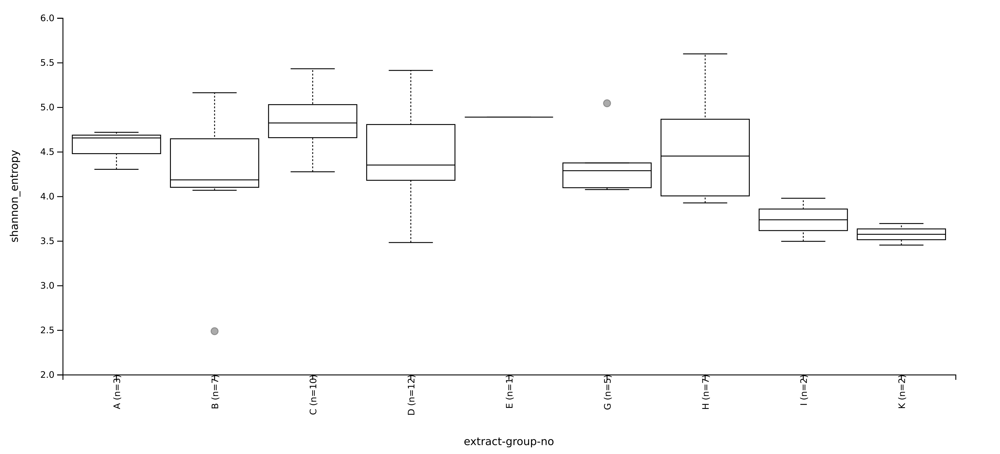
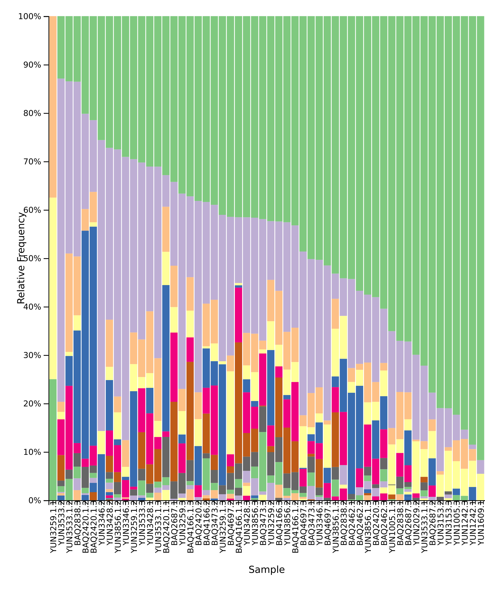
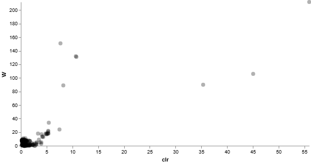

# metagenomic-analysis-qiime2
A detailed qiime2 pipeline for 16S rRNA microbiome and metagenomic data analysis

# Structure
```text
metagenomic-analysis-qiime2/
│
├── README.md
├── LICENSE
│
├── data/
│   ├── metadata/
│   │   └── sample-metadata.tsv
│   │
│   └── processed/
│       ├── table.qza
│       ├── rep-seqs.qza
│       ├── rooted-tree.qza
│       └── taxonomy.qza
│
├── results/
│   ├── alpha-diversity/
│   │   ├── faith-pd-group-significance.qzv
│   │   ├── shannon-group-significance.qzv
│   │   └── evenness-group-significance.qzv
│   │
│   ├── beta-diversity/
│   │   ├── unweighted-unifrac-transect-name-significance.qzv
│   │   └── unweighted-unifrac-emperor-depth.qzv
│   │
│   ├── taxonomy/
│   │   ├── taxonomy.qzv
│   │   └── taxa-bar-plots.qzv
│   │
│   └── ancom/
│       ├── ancom-extract-group-no.qzv
│       └── l6-ancom-extract-group-no.qzv
│
├── figures/
│   ├── alpha_faith_pd.png
│   ├── alpha_shannon.png
│   ├── alpha_evenness.png
│   ├── permanova.png
│   ├── taxa_barplot_level2.png
│   ├── taxa_barplot_level6.png
│   ├── ancom_otu.png
│   └── ancom_genus.png
│
├── scripts/
│   └── qiime2_workflow.sh
│
└── report/
    └── Informe_Metagenomica_QIIME2.pdf
```
# Metagenomic Analysis of Environmental Microbiomes Using QIIME2

## Overview

This repository contains a complete microbial community analysis workflow performed using QIIME2 on environmental 16S rRNA amplicon sequencing data.

The project includes:

* Sequence processing and denoising
* Diversity analyses (alpha and beta diversity)
* Phylogenetic reconstruction
* Taxonomic classification
* Differential abundance analysis using ANCOM
* BLAST validation of selected representative sequences

The workflow was developed as part of a metagenomics and microbial ecology training project.

---

## Objectives

The main objectives were:

* Characterize microbial diversity across environmental samples.
* Compare microbial communities between sampling locations.
* Identify taxonomic groups associated with specific environmental conditions.
* Validate taxonomic assignments using NCBI BLAST.

---

## Software

* QIIME2 2023.9
* Greengenes 13_8 database
* NCBI BLASTn
* MAFFT
* FastTree

---

## Workflow

### 1. Data Import

EMP paired-end sequences were imported into QIIME2 format.

### 2. Quality Control and Denoising

DADA2 was used to:

* Remove low-quality reads
* Correct sequencing errors
* Generate Amplicon Sequence Variants (ASVs)

### 3. Phylogenetic Analysis

Sequences were aligned using MAFFT and a rooted phylogenetic tree was generated using FastTree.

### 4. Diversity Analysis

Rarefaction depth:

**400 sequences/sample**

Retained:

* 49 samples
* 19,600 features
* 30.56% of total sequences

Alpha diversity metrics:

* Faith's Phylogenetic Diversity
* Shannon Diversity Index
* Pielou Evenness

Beta diversity metrics:

* Unweighted UniFrac
* PERMANOVA

### 5. Taxonomic Classification

Representative sequences were classified using the Greengenes 13_8 reference database.

### 6. Differential Abundance

ANCOM was used to identify differentially abundant taxa among extraction groups.

### 7. BLAST Validation

Selected ASVs were compared against the NCBI nucleotide database to evaluate taxonomic assignment consistency.

---

## Key Findings

### Alpha Diversity

Significant differences in richness and phylogenetic diversity were detected among environmental groups.

### Beta Diversity

PERMANOVA analysis revealed significant differences in microbial community composition among transects.

### Taxonomic Composition

The dominant phyla included:

* Proteobacteria
* Actinobacteria
* Acidobacteria
* Chloroflexi
* Planctomycetes
* Verrucomicrobia

Archaeal groups such as Nitrososphaera were also detected.

### Differential Taxa

ANCOM identified several ASVs and one genus-level taxon (Euzebya) showing differential abundance among sample groups.

---

## Repository Structure

```text
data/
results/
figures/
scripts/
report/
```

---

## Example Results

### Alpha Diversity




---

### Beta Diversity


---

### Taxonomic Composition



---

### Differential Abundance



---

## Author

Caren Moreno

Msc in Bioinformatics 

Universidad Intenacional de La Rioja


# License 
License MIT
