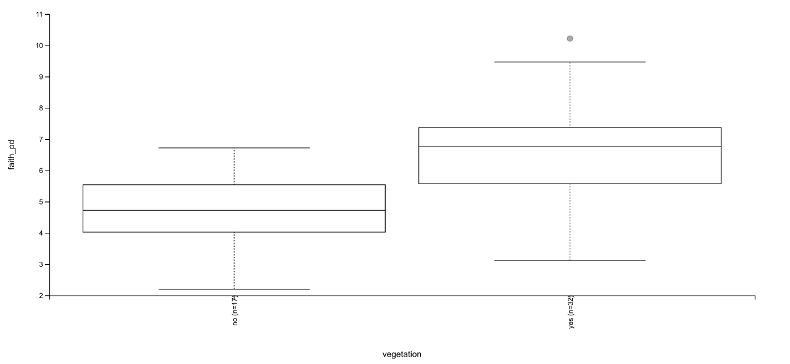
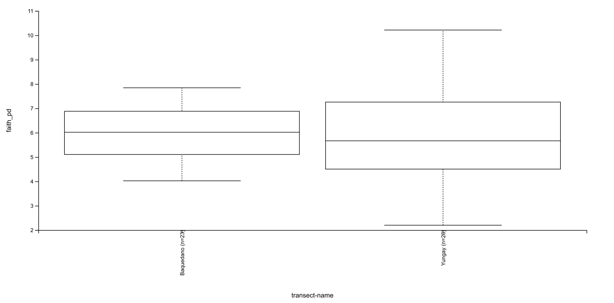
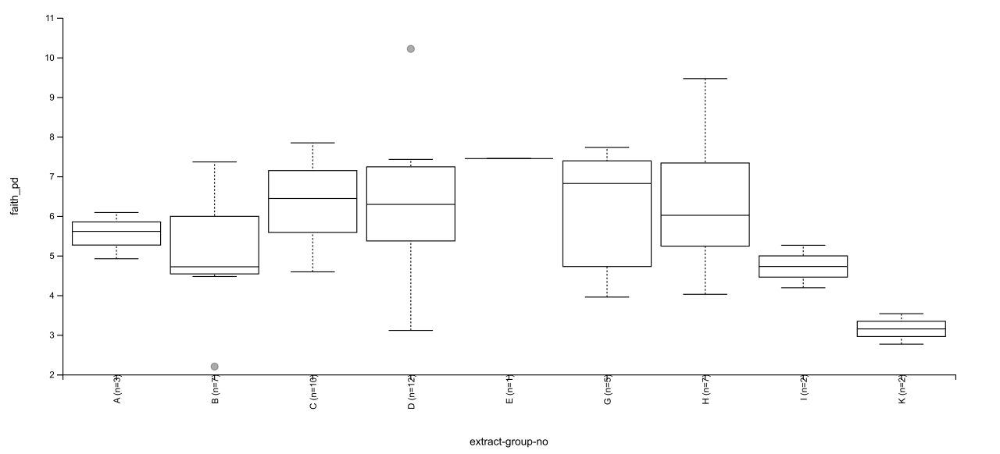

# metagenomic-analysis-qiime2
A detailed qiime2 pipeline for 16S rRNA microbiome and metagenomic data analysis

# 🧬 Metagenomic Analysis of Atacama Desert Soils with QIIME2

<p align="center">
  
  
  
  
</p>

<p align="center">
  <em>Master's in Bioinformatics · UNIR · Secuenciación y Ómicas de Próxima Generación</em><br>
  <strong>Caren Moreno</strong> · 2026
</p>

---

## 📌 Overview

This repository contains a complete QIIME2-based metagenomics workflow applied to the **Atacama Desert Soils** public dataset. The analysis characterizes the microbial community structure of one of the most extreme arid environments on Earth, evaluating how environmental variables such as vegetation cover, geographic transect, and soil extraction group shape microbial diversity.

---

## 🗂️ Repository Structure

```
metagenomic-analysis-qiime2/
│
├── README.md
├── LICENSE
│
├── data/
│   ├── metadata/
│   │   └── sample-metadata.tsv
│   │
│   └── processed/
│       ├── table.qza
│       ├── rep-seqs.qza
│       ├── rooted-tree.qza
│       └── taxonomy.qza
│
├── results/
│   ├── alpha-diversity/
│   │   ├── faith-pd-group-significance.qzv
│   │   ├── shannon-group-significance.qzv
│   │   └── evenness-group-significance.qzv
│   │
│   ├── beta-diversity/
│   │   ├── unweighted-unifrac-transect-name-significance.qzv
│   │   └── unweighted-unifrac-emperor-depth.qzv
│   │
│   ├── taxonomy/
│   │   ├── taxonomy.qzv
│   │   └── taxa-bar-plots.qzv
│   │
│   └── ancom/
│       ├── ancom-extract-group-no.qzv
│       └── l6-ancom-extract-group-no.qzv
│
├── figures/
│   ├── alpha_faith_pd.png
│   ├── alpha_shannon.png
│   ├── alpha_evenness.png
│   ├── permanova.png
│   ├── taxa_barplot_level2.png
│   ├── taxa_barplot_level6.png
│   ├── ancom_otu.png
│   └── ancom_genus.png
│
├── scripts/
│   └── qiime2_workflow.sh
│
└── report/
    └── Informe_Metagenomica_QIIME2.pdf
```

---

## 🔬 Workflow Summary

```
Raw paired-end reads (EMP format)
        │
        ▼
  [Step 1] Import → emp-paired-end-sequences.qza
        │
        ▼
  [Step 2] Demultiplex → demux-full.qza
        │
        ▼
  [Step 3] Subsample 30% → demux-subsample.qza
        │
        ▼
  [Step 4] Filter samples < 100 reads → demux.qza
        │
        ▼
  [Step 5] DADA2 denoising → table.qza · rep-seqs.qza
        │         (trim-left 13nt · trunc-len 150nt)
        ▼
  [Step 6] Phylogenetic tree → rooted-tree.qza
        │         (MAFFT alignment + FastTree)
        ▼
  [Step 7] Alpha & Beta diversity → core-metrics-results/
        │         (rarefaction depth: 400 reads · 49/54 samples retained)
        ▼
  [Step 8] Taxonomic classification → taxonomy.qza
        │         (Greengenes 13_8 · Naïve Bayes · 515F/806R)
        ▼
  [Step 9] Differential abundance → ANCOM results
                  (genus level: Euzebya identified)
```

---

## 📊 Key Results

### 1 · Rarefaction Depth Selection

After DADA2 denoising, **54 samples** and **1,085 ASVs** were retained.

| Statistic | Value |
|---|---|
| Minimum reads/sample | 8 |
| Maximum reads/sample | 2,118 |
| Median | 1,188 |
| Mean | 1,187.52 |

**Selected rarefaction depth: 400 reads/sample** → retains **49 samples (90.74%)** representing all sampling sites.

---

### 2 · Alpha Diversity

Alpha diversity was evaluated using three complementary metrics across all categorical metadata variables.
<table align="center" style="border: none; border-collapse: collapse;">
  <tr style="border: none;">
    <td align="center" style="border: none; padding: 10px;">
      <br>
      <sub><b>Vegetation</b></sub>
    </td>
    <td align="center" style="border: none; padding: 10px;">
      <br>
      <sub><b>Transect-name</b></sub>
    </td>
    <td align="center" style="border: none; padding: 10px;">
      <br>
      <sub><b>Extract_group_no</b></sub>
    </td>
  </tr>
</table>

#### 🌿 Richness - Faith Phylogenetic Diversity

| Variable | Kruskal-Wallis p-value | Significant? |
|---|---|---|
| **vegetation** | **p = 0.000072** | ✅ Yes |
| transect-name | p = 0.631 | ❌ No |
| extract-group-no | p = 0.161 | ❌ No |

> **vegetation** is the variable most strongly associated with differences in **microbial richness**. Soils with vegetation show significantly higher phylogenetic diversity, likely due to rhizosphere effects and organic matter inputs that generate additional ecological niches.

---

#### ⚖️ Evenness - Pielou's Evenness

| Variable | Kruskal-Wallis p-value | Significant? |
|---|---|---|
| **transect-name** | **p = 0.002** | ✅ Yes |
| vegetation | p = 0.089 | ❌ No |
| extract-group-no | p = 0.102 | ❌ No |

> **transect-name** is the variable most strongly associated with differences in **community evenness**. Baquedano and Yungay transects differ significantly in how evenly microbial abundances are distributed among taxa.

---

#### 📈 Shannon Index

Significant for both **vegetation** (p = 0.000218) and **transect-name** (p = 0.030), consistent with Shannon capturing both richness and evenness components.

---

### 3 · Beta Diversity - PERMANOVA

Analysis performed on **Unweighted UniFrac** distance matrix, variable: `transect-name`

| Parameter | Value |
|---|---|
| Test | PERMANOVA |
| Sample size | 49 |
| pseudo-F | 1.680 |
| **p-value** | **0.011** |
| Permutations | 999 |
| Baquedano vs. Yungay (pairwise) | p = 0.016 |

> Microbial community **composition differs significantly between transects** (p = 0.011). The Unweighted UniFrac metric indicates these differences are driven primarily by which lineages are present rather than by shifts in relative abundances.

---

### 4 · Taxonomic Classification (Greengenes 13_8 vs. BLAST)

Three representative ASVs were compared between Greengenes and NCBI BLASTn:

| ASV | Greengenes assignment | BLAST assignment | Discrepancy level |
|---|---|---|---|
| ASV 1 | *Cytophagaceae* (family) | *Ohtaekwangia koreensis* | **Family** |
| ASV 2 | *Verrucomicrobia* DA101 | *Chthoniobacter flavus* | **Genus** |
| ASV 3 | *Nitrososphaera* (genus) | *Nitrososphaera viennensis* | **Species** |

> BLAST provided higher taxonomic resolution in all three cases. Discrepancies at family and genus levels reflect nomenclature updates published after 2013 that are not captured by Greengenes 13_8.

---

### 5 · Differential Abundance - ANCOM

ANCOM was applied at two levels using `extract-group-no` as the grouping variable:

- **ASV level**: top ASVs showed W values of 1081, 1062, and 1039
- **Genus level (level 6)**: single significantly differential taxon identified:

| Taxon | W value | Classification |
|---|---|---|
| ***Euzebya*** | **212** | k__Bacteria · p__Actinobacteria · c__Nitriliruptoria · o__Euzebyales · f__Euzebyaceae |

> *Euzebya* was virtually absent in all groups except group K. This Actinobacteria genus has been described in arid soils and can tolerate extreme UV radiation and low humidity — conditions characteristic of the Atacama Desert.

---

## 🛠️ Software & Databases

| Tool | Version | Purpose |
|---|---|---|
| QIIME2 | 2023.9 | Main analysis framework |
| DADA2 | — | Denoising & ASV calling |
| MAFFT | — | Multiple sequence alignment |
| FastTree | — | Phylogenetic tree construction |
| Greengenes | 13_8 (99% OTUs) | Taxonomic classification |
| NCBI BLASTn | — | Independent sequence validation |

---

## ▶️ How to Reproduce

```bash
# 1. Install QIIME2 (conda)
# https://docs.qiime2.org/2023.9/

# 2. Activate environment
conda activate qiime2-2023.9

# 3. Run the full pipeline
bash commands_atacama.sh

# 4. Visualize .qzv outputs at:
# https://view.qiime2.org
```

---

## 📚 References

- Bolyen E, et al. (2019). Reproducible, interactive, scalable and extensible microbiome data science using QIIME 2. *Nature Biotechnology*, 37, 852–857.
- Callahan BJ, et al. (2016). DADA2: High-resolution sample inference from Illumina amplicon data. *Nature Methods*, 13, 581–583.
- DeSantis TZ, et al. (2006). Greengenes, a chimera-checked 16S rRNA gene database. *Applied and Environmental Microbiology*, 72(7), 5069–5072.
- Mandal S, et al. (2015). Analysis of composition of microbiomes: a novel method for studying microbial composition. *Microbial Ecology in Health and Disease*, 26.

---

## License

This project is distributed under the MIT  License.

---

<p align="center">
  Made with 🔬 by Caren Moreno · MSc in Bioinformatics UNIR · 2026
</p>
